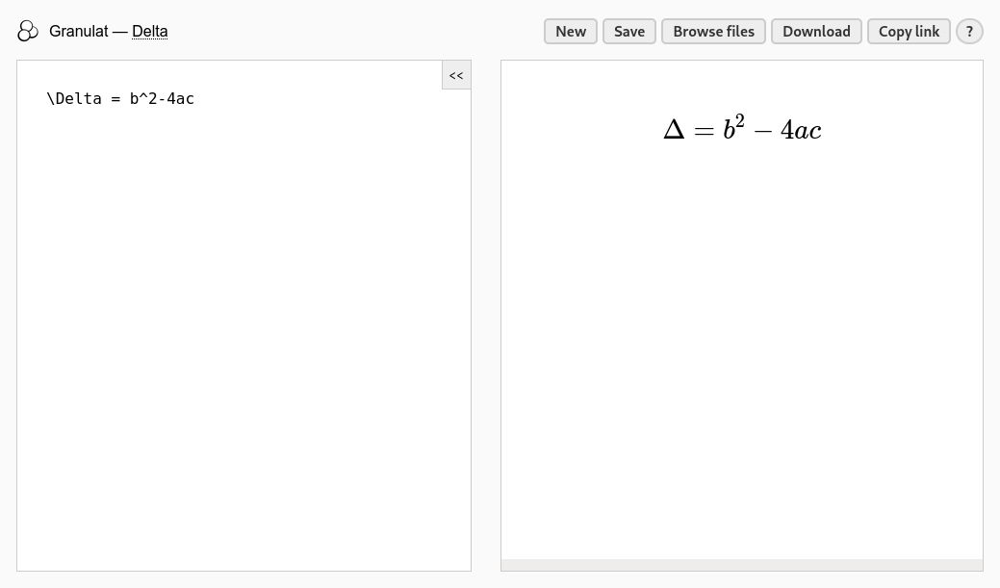

# [Granulat](https://granulat.vercel.app/)

	

*A simple local-first KaTeX equations editor and viewer.*

This app's window is divided into two main parts. On the left there is the editor and on the right there is the viewer.

You can hide the editor using a button at the top right hand corner of it.

Your documents are saved locally in your browser. You can save documents and browse saved documents using the buttons
at the top right hand corner of the window.

You can rename your document by clicking its name at the top left hand corner of the window.

There are two ways to share your documents. You can download them as a text file by clicking the 'download' button or you can
click 'copy link' to copy a link containing your document. Copying a link may be unavailable if your document is too big.

See [this site](https://katex.org/docs/supported.html) for available TeX functions.

